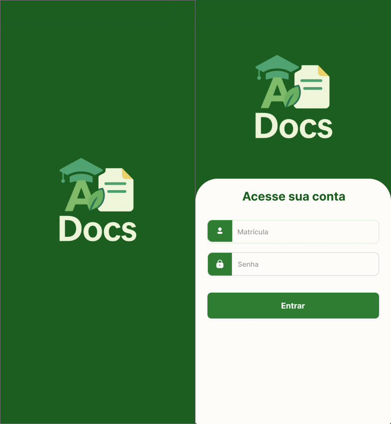
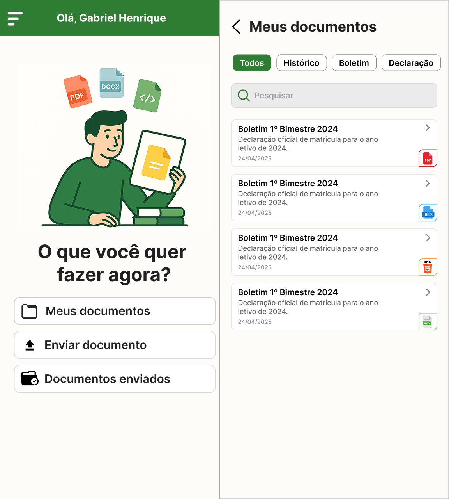
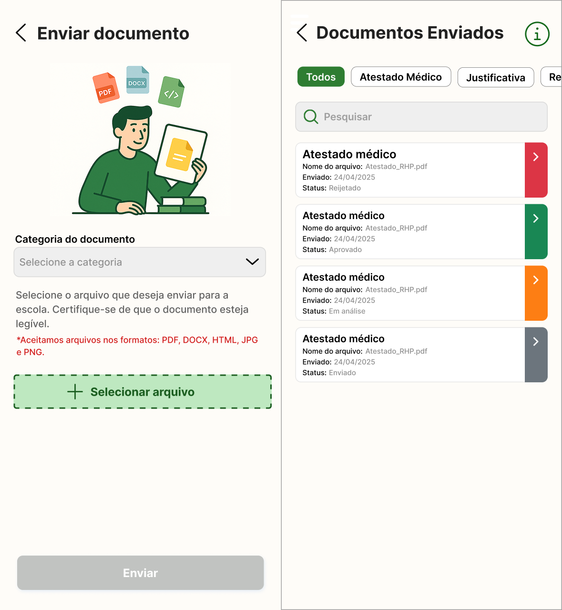

# 📚 Aluno Docs App

Um app intuitivo e moderno para que **alunos e responsáveis** possam **visualizar e enviar documentos escolares** com praticidade e segurança.

> 🔧 Desenvolvido com **React Native (Expo)**, focado em visualização e envio de documentos como PDF, DOCX, HTML e Imagens.  
> ⚠️ Este app **não é compatível com Expo Go**, pois utiliza diversas dependências nativas.

---

## ✨ Funcionalidades

- 🔐 **Login Simulado**  
  Acesso fácil para alunos ou responsáveis.

- 📄 **Visualização de Documentos Escolares**  
  Suporte para arquivos PDF, DOCX, HTML e imagens.  
  Renderização via WebView, PDFViewer e Document Viewer.

- 📤 **Envio de Novos Documentos**  
  Upload simples com integração de câmera, galeria e arquivos locais.

- 🔎 **Busca e Filtros por Categoria ou Nome**  
  Pesquise entre os documentos por nome ou categoria usando debounce para otimizar a performance.

- ⚡ **UX Responsiva e Moderna**  
  Animações suaves, navegação fluida e layout feito com NativeWind (Tailwind CSS para React Native).

- 🧪 **Dados Simulados com Mock API e JSON local**  
  As requisições e respostas são simuladas com `axios-mock-adapter`, sem necessidade de backend real.

---

## 🛠️ Tecnologias e Bibliotecas

| Categoria          | Tecnologias Utilizadas                                                           |
| ------------------ | -------------------------------------------------------------------------------- |
| 💡 Framework       | [React Native](https://reactnative.dev/), [Expo](https://expo.dev/)              |
| 📦 Navegação       | `@react-navigation/*`, Drawer, Stack                                             |
| 📑 Visualização    | `react-native-pdf`, `react-native-webview`, `@react-native-documents/viewer`     |
| 📁 Upload          | `expo-document-picker`, `expo-image-picker`, `expo-camera`                       |
| ⚙️ Requisições     | `axios`, `axios-mock-adapter`, `@tanstack/react-query`                           |
| 💾 Armazenamento   | `react-native-mmkv`, `expo-secure-store`                                         |
| 🧠 Estado Global   | `zustand`                                                                        |
| 🧩 UI & Estilo     | `nativewind`, `lucide-react-native`, `react-native-modal`, `shimmer-placeholder` |
| ✅ Forms/Validação | `react-hook-form`, `yup`                                                         |
| 🌐 Offline/Status  | `@react-native-community/netinfo`                                                |

---

## 📱 Como Rodar o Projeto

> ⚠️ O projeto **não é compatível com Expo Go**, pois utiliza bibliotecas com código nativo.

### 1. Clone o repositório

```bash
git clone https://github.com/GabrielHenriquez/aluno-docs-app.git
cd aluno-docs-app
```

### 2. Instale as dependências

```bash
npm install
# ou
yarn install
```

### 3. Execute no Android (emulador ou dispositivo físico)

```bash
npx expo run:android
```

### 4. Execute no iOS (apenas em MacOS)

```bash
npx expo run:ios
```

---

## 🔑 Como Acessar o App

O login é feito por **matrícula e senha**.

> ✅ Credenciais simuladas para teste:

- 📘 **Matrícula:** `263425`
- 🔐 **Senha:** `gabriel123`

Após realizar o login, você poderá visualizar documentos escolares e enviar novos arquivos.

## 📷 Imagens ilustrativas das principais telas (exemplo)

### 🔐 Splash / Login


### 📄 Home / Lista de Documentos


### 📤 Upload De Documento / Lista De Documentos Enviados


## 🧪 Desenvolvimento e Simulação

- Toda a funcionalidade de login, listagem, envio e filtros é baseada em **dados simulados com JSON local**.
- As requisições HTTP são interceptadas e tratadas por `axios-mock-adapter`.
- Ideal para testes e demonstrações sem dependência de um backend real.

---

## 💡 Diferenciais Técnicos

- 🧠 **Uso de MMKV** para armazenamento local rápido e persistente.
- 📄 **Visualização offline de documentos**: ao abrir um arquivo com internet, ele é baixado e salvo localmente, permitindo acesso posterior mesmo sem conexão.
- 📁 **Visualização inline de arquivos**: suporte a PDF, DOCX, HTML e imagens com renderização nativa e por WebView.
- 💨 **Compressão automática de imagens** ao selecionar um arquivo, garantindo envio leve e rápido.
- 🎨 **Layout moderno e responsivo** com NativeWind (Tailwind CSS para React Native).
- 📸 **Integração com câmera, galeria e arquivos locais**, utilizando permissões e APIs do Expo.

---

## 📌 Observações

- Este projeto tem foco em **MVP funcional e simulado**.
- O envio de documentos **não é real**: os arquivos enviados são armazenados localmente e **apenas simulados no mock** com seus caminhos locais. Por isso, os documentos exibidos na seção "Documentos enviados" usam caminhos locais para o preview.
- Documentos `.docx` **não são suportados em modo offline**, pois o WebView não consegue renderizar arquivos `.docx` diretamente de caminhos locais (`file://`). Para visualizar esse tipo de arquivo, é necessário estar online e com uma URL acessível.
- Não utiliza autenticação real nem banco de dados externo.
- Ideal para prototipação, testes de UX e evolução futura.

---

## 👨‍💻 Autor

Desenvolvido por **Gabriel Rick** 💙  
Se curtir o projeto, não esquece de deixar uma ⭐ no repositório!

---
